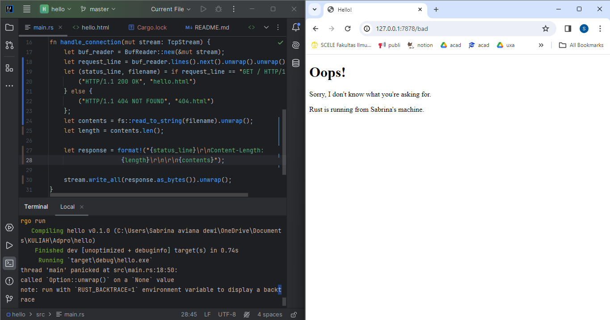

## Reflection
### Commit 1: handle_connection method
Method `handle_connection` bertanggung jawab untuk membaca steam line TCP yang masuk menggunakan BufReader baris demi baris sampai menemukan baris kosong, yang menandakan akhir dari header HTTP Request. Kemudian mencetak baris-baris yang terkumpul sebagai Request.
### Commit 2: new code on handle_conenction
Berikut adalah fungsi dari kode baru. Setelah `handle_connection` membaca isi dari file `hello.html` menggunakan `fs::read_to_string()`, HTTP Request yang terbaca akan dikirimkan kembali ke klien menggunakan `write_all()` melalui stream line TCP. Permintaan yang berhasil akan menunjukkan `status_line 200 OK`.

### Commit 3: refactor for validating request and selective responding
Saya me-refactor method `handle_connection` dengan conditional. Jika request klien adalah `GET / HTTP/1.1` yang menunjukkan request untuk path root ('/') maka akan diberikan response `200 OK` dan mengembalikan `hello.html`. Namun, jika selain path root, akan diberikan respons `404 NOT FOUND` dan mengembalikan `404.html`.
